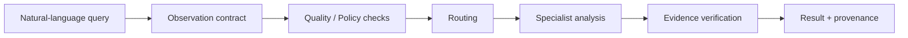

<div align="center">

# 🛰️ AETHERIS

### Satellite Observability & Sufficiency AI Engine

**Semantic Retrieval & Multi-Temporal Change Analysis of Satellite Imagery**


<br>


**[Overview](#-overview) · [Features](#-key-features) · [Architecture](#-architecture) · [Quick Start](#-quick-start) · [Usage](#-usage) · [API](#-api) · [Roadmap](#-roadmap)**

</div>

---

## 🎯 Overview

**AETHERIS** is an agentic satellite-imagery analysis engine built for **Smart India Hackathon 2026 — PS 26227**: *Semantic Retrieval and Multi-Temporal Change Analysis of Satellite Imagery*.

Most systems send every request to a single model and trust whatever comes back. AETHERIS does not. It asks a harder question first:

> **Is the available imagery actually sufficient to answer this query, and can the answer be proven?**

It converts a natural-language question into an Earth-observation workflow, checks whether the data can support it (observability and sufficiency), routes it to the right specialist, verifies the evidence, and returns a result with full provenance.

### The Core Flow



---

## ✨ Key Features

| Area | Capability |
|---|---|
| 🧠 **Planning** | Agentic planning with local Ollama / Qwen 2.5 |
| 🔎 **Retrieval** | Semantic / Geo-RAG retrieval |
| 🛰️ **Optical** | Optical imagery analysis, VQA and visual grounding |
| 📡 **SAR** | SAR preprocessing and analysis |
| 🕒 **Temporal** | Multi-temporal change analysis |
| 🔀 **Fusion** | Optical + SAR evidence fusion |
| ⚡ **JEV Engine** | Fast typed routing and verification |
| 🛡️ **Policy** | Policy validation *before* any tool executes |
| 🔐 **Integrity** | SHA-256 artifact verification and hash-chained audit logs |
| 📜 **Contracts** | Evidence-aware, structured result contracts |
| 🌐 **Interfaces** | Web GUI and FastAPI service |
| 📴 **Privacy** | Fully local / offline AI via Ollama |

### Trust Model: Verified · Qualified · Abstain

AETHERIS does not treat every model response as equally reliable. Each result is classified:

| Outcome | Meaning |
|---|---|
| ✅ **Verified** | Evidence is sufficient and confirmed |
| ⚠️ **Qualified** | Answer given with stated limitations |
| 🚫 **Abstain** | Data is insufficient, so the system declines to answer |

---

## 🧱 Architecture

[](https://gitdiagram.com/xdzy-td/aetheris-aiengine?utm_source=readme&utm_medium=picture)

### Analysis Stack

| Track | Pipeline |
|---|---|
| **Optical** | Preprocessing → VQA / grounding / change analysis |
| **SAR** | Preprocessing → SAR evidence → change / fusion |
| **Multi-temporal** | Acquisition comparison → change evidence → verification |
| **Semantic retrieval** | Query understanding → geospatial retrieval → evidence |

### Evidence & Audit

Every analysis artifact is traceable through:

- SHA-256 artifact verification
- Hash-chained audit logging
- Policy validation
- Structured result contracts
- Evidence verification

---

## 🚀 Quick Start

### Prerequisites

- Python 3.10+
- [Ollama](https://ollama.com/download)
- Git

### 1. Clone

```bash
git clone https://github.com/Xdzy-TD/Aetheris-AIEngine.git
cd Aetheris-AIEngine
```

### 2. Create a virtual environment

**Windows (PowerShell)**

```powershell
python -m venv .venv
.\.venv\Scripts\Activate.ps1
```

**Linux / macOS**

```bash
python3 -m venv .venv
source .venv/bin/activate
```

### 3. Install

```bash
python -m pip install --upgrade pip
pip install -e .
```

Optional extras:

```bash
pip install -e ".[all]"   # complete optional stack
pip install -e ".[vlm]"   # VLM support
```

---

## 🤖 Local LLM Setup (Ollama + Qwen 2.5 7B)

AETHERIS uses a local Ollama server for LLM-based planning. The client defaults to `qwen2.5:7b`.

```bash
ollama --version          # verify install
ollama serve              # start the server
ollama pull qwen2.5:7b    # download the model
ollama list               # confirm it is available
ollama run qwen2.5:7b     # optional: test it
```

### Configuration

| Variable | Default | Purpose |
|---|---|---|
| `OLLAMA_BASE_URL` | `http://localhost:11434` | Ollama server address |
| `AETHERIS_MODEL` | `qwen2.5:7b` | Model used for planning |

**Linux / macOS**

```bash
export OLLAMA_BASE_URL=http://localhost:11434
export AETHERIS_MODEL=qwen2.5:7b
```

**PowerShell**

```powershell
$env:OLLAMA_BASE_URL="http://localhost:11434"
$env:AETHERIS_MODEL="qwen2.5:7b"
```

Check that Ollama is reachable:

```bash
curl http://localhost:11434/api/tags
```

---

## ▶️ Usage

### Web GUI

```bash
python -m pipeline.run gui
```

Open **http://localhost:5000**

### Health check

```bash
python -m pipeline.run health
```

### CLI pipeline

```bash
# Default run
python -m pipeline.run pipeline

# Custom question
python -m pipeline.run pipeline -q "What land cover types are visible in this satellite image?"

# Specify modality
python -m pipeline.run pipeline -q "Identify changes between the observations." --modality optical
```

### Show the pipeline DAG

```bash
python -m pipeline.run dag
```

### ⚡ Recommended Demo Setup

**Terminal 1: Ollama**

```bash
ollama serve
```

**Terminal 2: AETHERIS**

```bash
cd Aetheris-AIEngine
# activate .venv first
ollama pull qwen2.5:7b
python -m pipeline.run health
python -m pipeline.run gui
```

Then open **http://localhost:5000**.

---

## 🌐 API

Start the FastAPI service:

```bash
uvicorn interfaces.api.app:app --host 0.0.0.0 --port 8000
```

Interactive docs: **http://localhost:8000/docs**

---

## 📁 Project Structure

```text
Aetheris-AIEngine/
├── controller/       # Planner, Ollama client, JEV, policy, audit, tools
├── specialists/      # Earth-observation analysis specialists
├── preprocessing/    # Image preprocessing and registration
├── pipeline/         # M01–M20 pipeline, GUI, CLI
├── interfaces/       # FastAPI and other interfaces
├── benchmark/        # Benchmark runner and dataset
├── evaluation/       # Evaluation utilities
├── training/         # Fine-tuning and calibration utilities
├── confidence/       # Confidence components
├── models/           # Model registry
├── tests/            # Test suite
├── docs/             # Architecture, setup, status
├── pyproject.toml
└── README.md
```

---

## 🧪 Testing & Linting

```bash
pytest -v        # run the test suite
ruff check .     # lint
```

---

## 🛣️ Roadmap

- [ ] Remote-sensing-adapted VLMs
- [ ] Better open-vocabulary grounding
- [ ] Bi-temporal Transformer / Change-VQA
- [ ] Calibrated confidence
- [ ] Indian EO dataset fine-tuning
- [ ] SAM2 / RS-specific segmentation
- [ ] Larger real-world evaluation benchmarks

> These are roadmap items unless separately integrated and evaluated in the repository.

---

## 📜 License

Released under the **Apache-2.0** License.

---

<div align="center">

### 🛰️ AETHERIS

*Semantic Retrieval • Multi-Temporal Change Analysis • Evidence-Aware Earth Observation*

**Hack & Slay · SIH 2026 · PS 26227**

</div>
