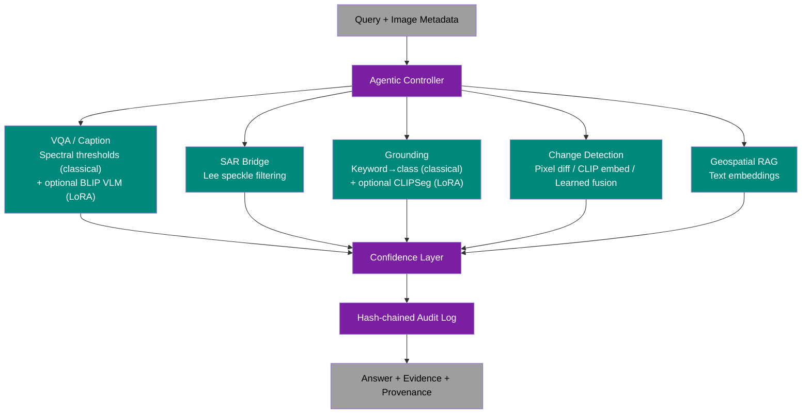

# Aetheris Architecture

> Agentic Remote-Sensing Intelligence System

## System Overview

Aetheris is an agentic satellite imagery analysis system where the **controller genuinely decides** — it inspects the query + input metadata and dynamically composes a tool chain, rather than running a fixed pipeline.

**Colour key:** Gray = input/output, Purple = orchestration/reasoning, Teal = specialist models.

## Controller Layer

### Agentic Planner (`controller/planner.py`)

The planner inspects each query and composes an `ExecutionPlan` — an ordered sequence of `ToolCall` steps. Each step specifies which specialist to invoke, what arguments to pass, and why (rationale).

Execution is delegated to `controller/executor.py` (`PlanExecutor`); result
metadata (model_version, warnings, confidence) is centralised in
`controller/result_contract.py` (`ResultContract`).

**Current routing logic (rule-based fallback, used when no LLM is reachable).**
Every plan — LLM or rule-based — then passes `controller/policy.py` before any
tool runs; see [`STATUS.md`](STATUS.md).

- SAR modality detected → prepend `sar_bridge`
- Multiple images → add `change_detection`
- Always route to `vqa_caption` as final step

**LLM planning:** Ollama-backed LLM planning via `controller/llm_planner.py`.

### Tool Registry (`controller/tool_registry.py`)

JSON-schema-driven catalog of specialist tools. Each tool is described by a schema file in `controller/tool_schemas/` specifying name, description, parameters, and return format — mirroring the function-calling / MCP paradigm.

### Routing Memory (`controller/memory.py`)

Session-scoped LRU cache keyed by `(session_id, image_hash, tool_name)`. Follow-up queries on the same AOI/image reuse prior embeddings and masks instead of recomputing.

**Selected differentiator: Agentic Intelligence.**

### Audit Log (`controller/audit_log.py`)

Hash-chained, tamper-evident execution trace. Each entry's `chain_hash` is `SHA-256(parent_chain_hash || entry_json)`, creating a chain where modifying any past entry invalidates every subsequent hash.

**Selected differentiator: Integrity & Trust.

## Specialist Modules

### VQA / Caption (`specialists/vqa_caption/`)

- **Classical baseline:** Spectral-index thresholds (excess-green, blue-dominance, brightness) — explainable proxy, not a trained VLM
- **Optional VLM:** BLIP (`vlm_vqa_caption`) via `transformers`, genuine weights, genuine forward pass — **not RS-adapted by default**. LoRA fine-tuning script exists (`training/finetune_vqa_lora.py`); adapter loads via `AETHERIS_VLM_LORA_PATH`
- **Output:** Natural language answer + raw confidence score

### SAR Bridge (`specialists/sar_bridge/`)

- **Method:** Classical Lee/refined-Lee speckle filtering — real SAR signal processing
- **Output:** Despeckled image path + method used

### Grounding (`specialists/grounding/`)

- **Classical baseline:** Keyword → land-cover class mask from spectral indices
- **Optional VLM:** CLIPSeg (`vlm_grounding`) — real open-vocabulary segmentation, **not RS-adapted by default**. LoRA adaptation follows the CLIPSeg-on-FLAIR recipe; adapter loads via `AETHERIS_GROUNDING_LORA_PATH`
- **Output:** Pixel-level binary mask + bounding box + area + confidence

### Change Detection (`specialists/change_detection/`)

- **Classical baseline:** FFT phase-correlation co-registration, then pixel differencing
- **Pretrained embedding:** CLIP vision-transformer patch embedding distance (`vlm_change_detection`) — genuine model signal, uncalibrated
- **Learned fusion:** Logistic regression over optical/SAR/temporal evidence channels (`fusion_change_detection`) — genuinely learned, ships unfitted
- **Output:** Change map + change summary

### Geospatial RAG (`specialists/geo_rag/`)

- **Index:** Sentence-transformer text embeddings (or in-memory NumPy fallback)
- **Output:** Context snippets + relevance scores

## Evidence & Provenance

Every specialist output carries typed `EvidenceArtifact` and `SpatialEvidence`
objects. The final `ExecutionResult` includes a `ProvenanceChain` that links
the answer to every artifact, model version, and audit-log hash that produced
it — making every AI conclusion traceable to geospatial evidence.

## Confidence Layer

### Conformal Prediction (`confidence/conformal.py`)

Wraps raw specialist scores in prediction intervals. Ships **unfitted** — no labelled calibration set exists, so `calibrated: false` is returned honestly.

### Self-Consistency (`confidence/self_consistency.py`)

Runs VLM-backed specialists multiple times and votes. Agreement ratio is a confidence signal.

## Adaptation Path

`controller/adaptation.py` discovers configured LoRA/adapter paths at startup
and reports what actually loaded vs. what's merely configured. This surfaces
in `GET /v1/models` alongside the static `models/registry.json` entries.

**No RS-adapted checkpoint ships with this repo.** See `STATUS.md` for details.

## Interfaces

### FastAPI (`interfaces/api/app.py`)

REST API with query submission (multipart upload), tool listing, audit verification, provenance lookup, and memory stats.

### Textual TUI (`interfaces/ui/console.py`)

Terminal-based operator console with query input, live trace viewer, tool status dashboard, and memory stats.

### Flask GUI (`run_gui.py`)

Web-based interface with voice dictation (Web Speech API) and a Leaflet world map.

## Deployment Tiers

1. **Cloud/API demo:** Docker Compose with Aetheris API + optional Ollama
2. **On-prem:** CPU-only with classical baselines, no external calls
